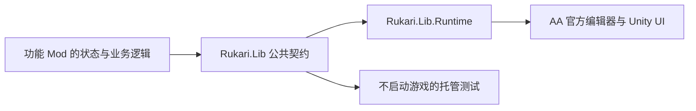

# Rukari Lib 0.4.1：公共接口、编辑事务与统一 UI

本文说明本交付包中 Rukari Lib 的实际实现。公共托管契约位于 `Rukari.Lib`，游戏内宿主位于 `Rukari.Lib.Runtime`；更多的画面效果 1.4.0 使用这些共享服务。源码链接均相对于本交付包。

## 1. 公共库与游戏内宿主各自负责什么

`Rukari.Lib` 目标框架为 .NET 6。其项目不引用 Unity、BepInEx 或游戏程序集，公共数据由字符串、数值、记录类型和托管集合组成。服务发现、排队、编辑会话、工具树、面板描述和设置页管理因此可以在不启动游戏的情况下检查。

`Rukari.Lib.Runtime` 负责把这些契约接到当前 AA：加载 BepInEx 插件，捕获 Unity 主线程，接入官方工作台，创建共享 UI，协调输入，安装共享编译边界。涉及 Unity 或 IL2CPP 对象的工作留在这一层的同步调用内。

功能 Mod 提供自己的参数、草稿、指令解析和执行逻辑。公共库不把所有功能塞进统一的数据模型；它提供的是这些功能共同需要的宿主与事务边界。



入口依据：[公共运行时契约](../src/Rukari.Lib/RuntimeContracts.cs)、[公共库项目](../src/Rukari.Lib/Rukari.Lib.csproj)、[Runtime 插件](../src/Rukari.Lib.Runtime/Plugin.cs)。

## 2. 服务发现、capability 与生命周期

### 2.1 获取运行时

消费者通过 `ModServices.Current` 或 `ModServices.TryGetRuntime` 获取当前运行时。得到非空对象后仍需检查 `State`：

| 状态 | 含义 |
|---|---|
| `Starting` | 尚未接受服务操作。 |
| `Ready` | 可以发现服务、注册服务并提交操作。 |
| `Stopped` | 停止接收操作、清空注册；这个实例不能再次启动。 |

Runtime 插件 `Load` 创建 `ModRuntimeHost`，调用 `Start` 后挂接到 `ModServices`。`RuntimeBehaviour.Update` 每帧泵送队列并更新工具宿主；销毁或退出时依次清理共享服务、解除挂接并停止 host。不要把一次取得的服务引用当作跨重载的永久对象。

依据：[ModServices](../src/Rukari.Lib/ModServices.cs)、[ModRuntimeHost](../src/Rukari.Lib/ModRuntimeHost.cs)、[RuntimeBehaviour](../src/Rukari.Lib.Runtime/Plugin.cs)。

### 2.2 capability 描述能力范围

`GetCapability(id)` 返回 `CapabilityInfo`：能力 ID、提供者 ID、契约版本、成熟度与说明。`Available`、`Experimental`、`Verified`、`Unavailable` 是提供者声明；消费者应同时读取 `Detail`，不能仅凭枚举名推导所有游戏版本的效果。

当前交付中的主要服务如下。服务注册是否成功仍取决于宿主入口和配置。

| 服务契约 | capability ID | 提供者与用途 |
|---|---|---|
| `IEditorDocumentService` | `rukari.editor.documents` | Lib Runtime：当前台词读取、额外指令替换和共享撤销。 |
| `IToolboxService` | `rukari.tools.toolbox` | Lib Runtime：节点内工具树、普通页面与 hosted 页面。 |
| `IToolInputService` | `rukari.tools.input` | Lib Runtime：共享鼠标区域与拖动捕获。 |
| `IModSettingsService` | `rukari.settings` | Lib Runtime：官方设置入口中的全局 Mod 设置页。 |
| `IEmbeddedDirectiveService` | `rukari.commands.compilation` | Lib Runtime：已登记指令路由的共同编译净化。 |
| `IEditorSaveService` | `aavt.editor.save` | MoreEffects：调用官方保存、编译、发布链。Lib 负责声明接口与绘制按钮。 |

公共库还保留声音、Spine 和字幕相关契约及托管模型。本仓库同时提供独立配音与 Spine 功能 Mod，但不提供字幕插件。发现不到提供者时，应按缺少能力处理。

依据：[EditorHost](../src/Rukari.Lib.Runtime/Editor/EditorHost.cs)、[ToolsHost](../src/Rukari.Lib.Runtime/Tools/ToolsHost.cs)、[SettingsHost](../src/Rukari.Lib.Runtime/Settings/SettingsHost.cs)、[EmbeddedDirectiveHost](../src/Rukari.Lib.Runtime/Commands/EmbeddedDirectiveHost.cs)、[MoreEffects 插件](../src/Rukari.MoreEffects/Plugin.cs)。

### 2.3 注册返回 lease

`RegisterService<T>(ownerId, service, capability)` 在主线程注册服务。`ownerId` 必须与 `capability.ProviderId` 一致；同一服务类型或 capability ID 已有注册时返回 `Conflict`，不会覆盖原提供者。返回的 `IDisposable` 是这次注册的 lease；释放它只移除这一项。

运行时关闭时清空注册和排队操作，不调用服务对象自己的 `Dispose`。提供者拥有自己的对象、界面和资源寿命，必须自行清理。工具页、指令路由、输入区域、设置页也各自返回 lease；其关闭窗口与注销注册是不同动作，关闭窗口一般保留功能页草稿。

不同 lease 的线程约束以对应接口为准。服务注册要求主线程；输入区域更新、设置页注册和设置 lease 释放也要求主线程。示例统一在游戏主线程卸载工具页，以便配合 UI 生命周期。

依据：[服务注册实现](../src/Rukari.Lib/ModRuntimeHost.cs)、[工具和输入契约](../src/Rukari.Lib/Tools/ToolContracts.cs)、[设置契约](../src/Rukari.Lib/Settings/SettingsContracts.cs)。

## 3. 主线程操作队列与结果类型

托管的服务发现允许从其他线程调用；查到服务后，调用其主线程方法仍应经过 `InvokeAsync`。

- 已在捕获的主线程上：同步执行操作，返回一个已完成的任务。
- 在其他线程上：加入 FIFO 队列。默认最多128项待执行操作；每帧最多泵送32项。队列满返回 `Busy`。
- 尚未开始的操作收到取消：从队列移除并返回 `Cancelled`。
- 操作已开始：取消或关闭不会把已发生的事务宣称为撤销；返回实际执行结果。
- 提供者抛出异常或返回空结果：转换为 `ProviderFailed`。提供者代码不在注册表锁内执行，可以查询服务或提交嵌套操作。

调用方应 `await`；不要在游戏主线程同步等待后台已排队的操作。也不要在后台捕获 Unity/IL2CPP 对象后放进委托，等待稍后使用；应在实际执行的同步提供者操作中重新取得当前游戏状态。

`ModResult<T>` 通过 `Success`、`Value`、`Error` 明确表达结果。程序判断使用 `ModErrorCode`，包括 `NotReady`、`WrongThread`、`Conflict`、`Busy` 等；`Error.Message` 用于展示诊断，不应当作稳定协议解析。

依据：[队列与取消实现](../src/Rukari.Lib/ModRuntimeHost.cs)、[结果契约](../src/Rukari.Lib/ModResult.cs)、[队列测试](../src/Rukari.Lib.Tests/RuntimeHostTests.cs)。

## 4. 当前台词的共享编辑事务

### 4.1 快照与替换接口

`IEditorDocumentService.ReadSelection()` 返回 `EditorDocumentSnapshot`：

| 字段 | 作用 |
|---|---|
| `SelectionToken` | 当前显示选择的临时不透明 token，用于把应用动作绑定到创建草稿时的选择。 |
| `ContextId` | 当前工作台、节点、Script 实例与行索引的运行期组合身份。不是保存文件中的永久台词 ID。 |
| `Revision` | 当前额外指令文本 UTF-8 SHA-256，用于检查草稿生成后的内容变化。 |
| `DialogueText` / `AdditionalPrompt` | 本次读取的原文。 |
| `CanUndo` | 当前上下文和内容是否还匹配共享的上一笔事务。 |
| `NativeFields` | 额外的托管字段快照；当前 backend 提供原生 `voice` 字段字符串。 |

应用时传入 `EditorDocumentEditRequest(SelectionToken, ExpectedRevision, AdditionalPrompt)`。公共事务接受的是整段额外指令的精确替换；指令的含义、保留哪些行、参数校验由功能提供者决定。它不修改台词正文，也不解析立绘或镜头参数。

`EditorHost` 在 `ScriptNodeInspector.DataList(int)` 与 `OnChildSelect(Selectable)` 的前置边界使选择 token 失效。即使切换到别句后又返回原句，旧草稿也不能借一个新观察到的 token 获得写入资格。

依据：[编辑契约](../src/Rukari.Lib/Editor/EditorContracts.cs)、[编辑会话](../src/Rukari.Lib/Editor/EditorDocumentSession.cs)、[选择失效接入](../src/Rukari.Lib.Runtime/Editor/EditorHost.cs)。

### 4.2 从读取到回滚的七项核对

以下按实际数据经过的层次整理核对点，便于阅读现有实现：

| 核对点 | 代码行为 |
|---|---|
| 1. 运行时与调用状态 | 要求运行时就绪、主线程、没有另一个正在写入的共享操作。 |
| 2. 当前工作台与选中行 | 节点编辑器可见；工作台未整理列表；从现有可见行中找到唯一 `selected` 行；行所属工作台、节点、索引均一致。 |
| 3. 官方输入同步 | 额外指令输入框必须等于 Script 的 `additionalPrompt`；台词输入框必须等于 Script 的 `text`。尚未同步的输入不能被旧草稿覆盖。 |
| 4. 草稿的 token 与 revision | 应用前重新读取，比较创建草稿时的 token 和额外指令 SHA-256；不接受旧选择或旧版本。 |
| 5. 实际写入前重新取得对象 | backend 再次 `Resolve()`，比较上下文、正文和原额外指令，避免继续使用上次读到的 native wrapper。 |
| 6. 官方写入与精确读回 | 调用 `UIInput.Set(text, false)`，再调用 `ScriptNodeInspector.SetAdditionalPrompt()`；重新读取，核对上下文、正文和目标额外指令。会话层再核对一次返回结果。 |
| 7. 失败后的有条件回滚 | 只在原上下文、原正文仍有效，且 Script/输入框没有第三种并发修改时恢复原文；恢复后再次读回。已切换台词或出现其他修改时不覆盖新内容。 |

backend 的 native wrapper 仅存在于一次同步操作中；`ContextId` 中的指针数值用于身份比较，没有在公共库里解引用。

依据：[NativeEditorDocumentBackend](../src/Rukari.Lib.Runtime/Editor/NativeEditorDocumentBackend.cs)、[EditorDocumentSession](../src/Rukari.Lib/Editor/EditorDocumentSession.cs)。

### 4.3 共享撤销

会话保存一笔 `Context + Dialogue + Before + After` 记录。撤销要求当前上下文、正文、额外指令仍精确等于这笔事务的 `After`，随后走同一 backend 写入流程恢复 `Before`。成功撤销清空记录；下一笔成功修改覆盖上一笔。

这是参与共享事务的工具共同使用的一笔撤销，不是整个工程的无限历史。外部编辑改变当前内容后，旧记录不再可用。相同文本的替换返回 `Changed=false`，不会制造新的写入事务。

依据：[共享撤销实现](../src/Rukari.Lib/Editor/EditorDocumentSession.cs)、[事务测试](../src/Rukari.Lib.Tests/EditorDocumentSessionTests.cs)。

## 5. 统一工具树与两种页面

### 5.1 工具树

同一 `ownerId` 的多个页面共用一个模块入口，第一项页面提供模块标题和图标。`ToolTreeState` 表达三种深度：0为工具栏，1为展开的模块列，2为打开的叶子面板。多页面模块另有可选择的条目列，单页面模块直接打开面板；返回操作逐级收起。提供者卸载后，树状态会与现存模块、页面重新同步。

工具宿主只在实际可见的 Script 节点工作台显示；离开节点、切到别的 inspector、加载或卸载节点、祖先面板透明/禁用，都使工具收起并释放输入。这项可见性检查不要求已经选中一句台词；某个功能是否需要当前台词由该功能处理。

官方人物、表情、音乐、音效、背景和弹图选择窗口打开时，整个工具入口、侧栏与展开的工具页也隐藏，关闭后只恢复入口，须重新展开。Runtime 的 `EditorWorkspaceContext.IsToolWorkspaceVisible` 负责这条显示边界；`IsNodeEditorVisible` 仍表示底下的 Script 工作台存活，文档提供者不得用暂时遮挡作为清空立绘、镜头或屏幕文字草稿的依据。工具页仍按已有 `OnHidden` 关闭语义处理自己的临时状态。

当前 AAfix 4 适配从该 inspector 的祖先定位 `UI Root/WindowPanel`，非泛型查询 `WindowManager`，读当前 `blocking` 及其面板可见状态。选择器的 GameObject 初始便可为 active，不能据此判断弹窗已打开；`activeWindow` 也可能保留旧引用，不能凭它单独阻断工具。窗口状态读取失败时工具保持隐藏。该检测不缓存场景包装器，不增加 Harmony 补丁，也不调用官方窗口的 Show/Hide。

`IToolboxService.IsOpen` 实际表示叶子面板已打开且渲染器可用，并同时满足节点可见、全局设置未打开。仅显示工具栏或条目列不等同于 `IsOpen=true`。

依据：[ToolTreeState](../src/Rukari.Lib/Tools/ToolTreeState.cs)、[ToolsHost](../src/Rukari.Lib.Runtime/Tools/ToolsHost.cs)、[EditorWorkspaceContext](../src/Rukari.Lib.Runtime/Editor/EditorWorkspaceContext.cs)。

### 5.2 普通快照页面

`RegisterPage` 接受 `Func<ToolPageSnapshot>` 与 `Action<ToolAction>`。提供者返回摘要、按钮、列表、状态和列表动作 ID；共享宿主处理搜索、分页和绘制，把动作 ID 与值传回提供者。列表 ID 是不透明标识，不被工具箱解释为路径。

当前实现最多16个已登记页面；一个普通页面最多8个按钮、10,000条列表项。宿主复制按钮和列表数组并检查非空、唯一 ID；提供者也不能在返回后继续修改这些列表。页面读取失败显示该页的错误状态，不把错误当成另一个功能动作。

保留五参数的原 `RegisterPage` 签名，显式图标通过另一个重载提供；`ToolButton.Skin` 使用新增的 init 属性保留原构造签名。

依据：[ToolContracts](../src/Rukari.Lib/Tools/ToolContracts.cs)、[普通页面注册和读取](../src/Rukari.Lib.Runtime/Tools/ToolsHost.cs)。

### 5.3 Hosted 页面与冻结接口

复杂编辑器通过 `RegisterHostedPage` 提供 `IToolPanelContent`。Lib 负责共享画布、窗口、标题、关闭按钮、主题和输入；页面通过 `Draw(IToolPanelSurface)` 请求内容区内控件。`IToolPanelContent` 保留 `PreferredHeight` 和 `Draw` 这两个成员。

当前契约明确冻结已有 hosted 基础接口。以后增加能力通过并列接口表达，避免让已经编译的页面因为缺少新增成员而加载失败：

| 可选接口 | 作用 |
|---|---|
| `IToolPanelSizing` | 请求面板宽度；无效数值使用共享默认，宿主仍按窗口限制尺寸。 |
| `IToolPanelLifecycle` | `OnShown` / `OnHidden` 配对通知。 |
| `IToolPanelSurfaceTopDown` | 从顶端向下分配 `Band`，与基础 `Row` 从底端向上布局配合。 |
| `IToolPanelSurfaceStyledButtons` | 按共享语义角色绘制主操作、撤销、选中等按钮。 |
| `IToolPanelSurfaceColours` | 色块，用于颜色选择器和所见颜色预览。 |
| `IToolPanelSurfaceText` | 输入框与本帧键盘、光标移动、选择及 IME 组合输入快照。 |

页面通过类型判断使用这些能力；缺少可选表面时可以退回基础控件。类型判断不能代替对应契约程序集的版本要求：若插件源码引用了某个新接口，安装的 Lib 必须包含该类型。

依据：[ToolPanelContracts](../src/Rukari.Lib/Tools/ToolPanelContracts.cs)、[ToolPanelBuilder](../src/Rukari.Lib/Tools/ToolPanelBuilder.cs)、[公开契约检查](../src/Rukari.Lib.Tests/PublicContractTests.cs)。

### 5.4 布局、生命周期与坐标

hosted 内容坐标以内容区左下角为原点、Y向上，单位为页面画布单位；`Pointer` 已由宿主转换到该坐标。`BoundsInPixels` 则是物理屏幕像素矩形。虽然两种矩形都使用 `ToolInputRect` 结构，语境与单位不同，不能把页面内坐标直接登记成屏幕捕获区。

`ToolDrawerLayout` 根据实际窗口计算工具栏、模块列和面板位置、缩放及屏幕内边界。页面应读取当前 `Width`、`Height` 和 `BoundsInPixels`，不能假定面板永远按原请求尺寸显示。

`ToolPanelSession` 只在页面变化时产生转换：先隐藏旧页，再显示新页。收起面板、切页、离开工作台和销毁工具箱均触发隐藏；同一页连续绘制不会每帧重复 `OnShown`。页面在 `OnHidden` 清理自己持有的临时预览或昂贵状态，注册 lease 的释放另行处理。

更多的画面效果中部分旧的复杂可视化内容通过 hosted 包装定位已有画布；一般新增页面直接使用托管表面，不需要自行建立另一套窗口与输入系统。

依据：[ToolDrawerLayout](../src/Rukari.Lib/Tools/ToolDrawerLayout.cs)、[ToolPanelSession](../src/Rukari.Lib/Tools/ToolPanelSession.cs)、[ToolboxDrawer](../src/Rukari.Lib.Runtime/Tools/ToolboxDrawer.cs)、[MoreEffects hosted 包装](../src/Rukari.MoreEffects/Runtime/VisualEditorHostedContent.cs)。

## 6. 共享输入与关闭帧处理

`IToolInputService.RegisterRegion(ownerId, regionId)` 返回输入区域 lease。`Update` 复制物理屏幕矩形；空集合释放区域，`captureAllPointer=true` 用于拖动期间持续占有鼠标，结束后必须恢复。当前上限为64个区域，每次更新最多128个矩形。

Runtime 统一接入 `UICamera.ProcessMouse()`。鼠标落在任意活动区域或正在全局捕获的拖动中时，跳过该次官方鼠标处理；区域外继续官方流程。共享守卫读取失败时继续官方处理，不能将它描述为覆盖所有输入路径的永久屏蔽。

文本焦点额外要求完整安装三个零参数路径的键盘守卫：`UICamera.ProcessOthers()`、`UIInput.Update()`、`UIInputOnGUI.OnGUI()`。无法完整安装时不启用工具搜索与依赖该能力的全局设置窗口。获得焦点时立即捕获；释放延迟到下一次 pump，使关闭点击或最后一个字符不会在同帧继续进入后方输入框。

工具树层级切换也保留当前关闭帧的捕获，再由下一帧发布新几何，防止旧面板关闭的点击穿透到工作台。隐藏、失败或销毁时释放区域、焦点与拖动状态。

依据：[ToolInputService](../src/Rukari.Lib.Runtime/Tools/ToolInputService.cs)、[ToolboxDrawer 的 BeginLevelChange / Hide](../src/Rukari.Lib.Runtime/Tools/ToolboxDrawer.cs)、[可视化页输入协调](../src/Rukari.MoreEffects/Runtime/VisualEditorInputGuard.cs)。

## 7. 全局设置页

`IModSettingsService` 与节点工具箱独立：由官方设置界面中的入口打开，不要求当前工程或台词选择。每个 owner 注册一个栏目，重复 owner 返回冲突；内容仍使用 hosted 表面和可选生命周期接口。

Lib 负责窗口、栏目的选择及页面异常隔离；设置值是否持久化、如何写配置、如何影响功能，由页面提供者实现。登记设置页本身不启用播放主题，也不自动保存值。当前 Lib 自带页是入口说明页。

设置打开后节点工具箱让出输入与显示。官方设置界面不再可见时关闭 Mod 设置窗口；关闭、切页和卸载处理对应的生命周期。`Open` 只有在 native host 确认显示后才返回成功；页面绘制错误停用该页并显示错误，其他栏目仍可选择。

依据：[设置契约](../src/Rukari.Lib/Settings/SettingsContracts.cs)、[ModSettingsService](../src/Rukari.Lib/Settings/ModSettingsService.cs)、[SettingsHost](../src/Rukari.Lib.Runtime/Settings/SettingsHost.cs)、[OfficialSettingsEntry](../src/Rukari.Lib.Runtime/Settings/OfficialSettingsEntry.cs)、[SettingsWindow](../src/Rukari.Lib.Runtime/Settings/SettingsWindow.cs)、[设置测试](../src/Rukari.Lib.Tests/ModSettingsTests.cs)。

## 8. 主题、图集与备用绘制

### 8.1 页面请求角色，Lib 决定外观

`ToolSurfaceStyle` 提供 `Normal`、`Primary`、`Selected`、`Disabled`、`Undo`、`Panel`、`Header`、`Solid` 等语义角色；`ToolSurfaceStyles.ThemeKey` 与 `ToolPalette` 统一映射颜色。普通按钮也可请求已知的 `ToolButtonSkins`，未知外观退回共享样式。

Runtime 的 `ToolTheme`、`OfficialButtonSkin`、`OfficialPopupFrame`、`ToolPlateSkin` 和 `RailIconPainter` 实现主题、按钮、窗口边缘与图标。Unity材质、贴图、Sprite缓存只在Runtime维护，关闭时清理。

依据：[ToolPalette](../src/Rukari.Lib/Tools/ToolPalette.cs)、[ToolPanelContracts](../src/Rukari.Lib/Tools/ToolPanelContracts.cs)、[ToolTheme](../src/Rukari.Lib.Runtime/Tools/ToolTheme.cs)、[OfficialButtonSkin](../src/Rukari.Lib.Runtime/Tools/OfficialButtonSkin.cs)。

### 8.2 一套配对素材

运行时从自己的 `Rukari.Lib.Runtime.dll` 旁边的 `ui` 目录加载共享皮肤，不从功能 Mod 目录或任意解包目录寻找。`BundledUiAssets` 要求这四份数据文件：

```text
ui/
  ui-assets.sha256
  NOTICE.md
  atlases/Common.png
  metadata/Common.json
  decorations/Popup_Img_Deco_1.png
  decorations/Popup_Img_Deco_2.png
```

`ui-assets.sha256` 记录四份数据文件的SHA-256。读取器拒绝错误文件集合、重复项、未知相对路径、校验不一致或无效坐标元数据。验证后保留同一组字节快照，再由Runtime解码并建立Sprite；运行中改磁盘文件不会拼成新旧混合皮肤。

元数据提供图集坐标和切片边界；`AtlasEmblemSource` 提供图标、按钮板、图集Sprite和装饰的统一访问。整套读取失败时使用程序绘制的外观；某个Sprite不可用时对应控件回退，不影响公共服务类型的存在。

本交付源码与素材配套包分开保存。补齐素材后，项目内容项会将其复制到Runtime输出的 `ui` 目录。素材来源说明随配套包提供；代码许可不改变素材自己的归属。

依据：[BundledUiAssets](../src/Rukari.Lib/Tools/BundledUiAssets.cs)、[AtlasSpriteCatalog](../src/Rukari.Lib/Tools/AtlasSpriteCatalog.cs)、[AtlasEmblemSource](../src/Rukari.Lib.Runtime/Tools/AtlasEmblemSource.cs)、[Runtime 内容项](../src/Rukari.Lib.Runtime/Rukari.Lib.Runtime.csproj)。

### 8.3 测试与素材的关系

Lib测试既有临时生成的最小皮肤测试，也有检查实际随包图集的 `ShippedSkinContainsTheChromeAndValidSpriteBounds`。后者发现源码根的 `build.ps1` 后会读取Runtime输出皮肤，要求当前图集尺寸与关键Sprite匹配。因此本交付的完整测试需要先按总说明补齐配套素材；缺少素材可编译源码、运行时可使用备用外观，但不能据此声称实际皮肤测试已通过。

依据：[BundledUiAssetsTests](../src/Rukari.Lib.Tests/BundledUiAssetsTests.cs)。

## 9. 扩展范例

本包保留四个示例，按它们实际的职责阅读：

| 示例 | 展示内容 |
|---|---|
| [UiToolboxClient](../src/examples/UiToolboxClient/UiToolboxClient.cs) | 纯契约消费者；能力检查、主线程登记普通页与hosted页、lease清理、共享表面绘制。 |
| [UiToolboxPlugin](../src/examples/UiToolboxPlugin/UiToolboxPlugin.csproj) | 可加载插件外壳，复用前一示例的helper源码；游戏内项目引用仍需开发者本地程序集。 |
| [SharedVoiceClient](../src/examples/SharedVoiceClient/SharedVoiceClient.csproj) | 使用声音公共契约与显式能力发现；声音提供者未加载时按缺失能力返回。 |
| [EmbeddedDirectiveClient](../src/examples/EmbeddedDirectiveClient/EmbeddedDirectiveClient.csproj) | 登记自定义路由，统计编译通知；编译回调本身不作为播放事件。 |

典型接入顺序为：检查 `ModServices.Current` 与状态，读取 capability，在 `InvokeAsync` 内重新查找服务，保存成功登记的 lease。需要编辑台词时先读取选择快照，在自己的草稿中保存原token与revision，验证后提交精确替换；卸载时停止提供者工作并释放相应lease。

与指令净化、保存发布和预览/正式播放的关系，见 [04_指令编辑保存编译与播放](04_指令编辑保存编译与播放.md)。
