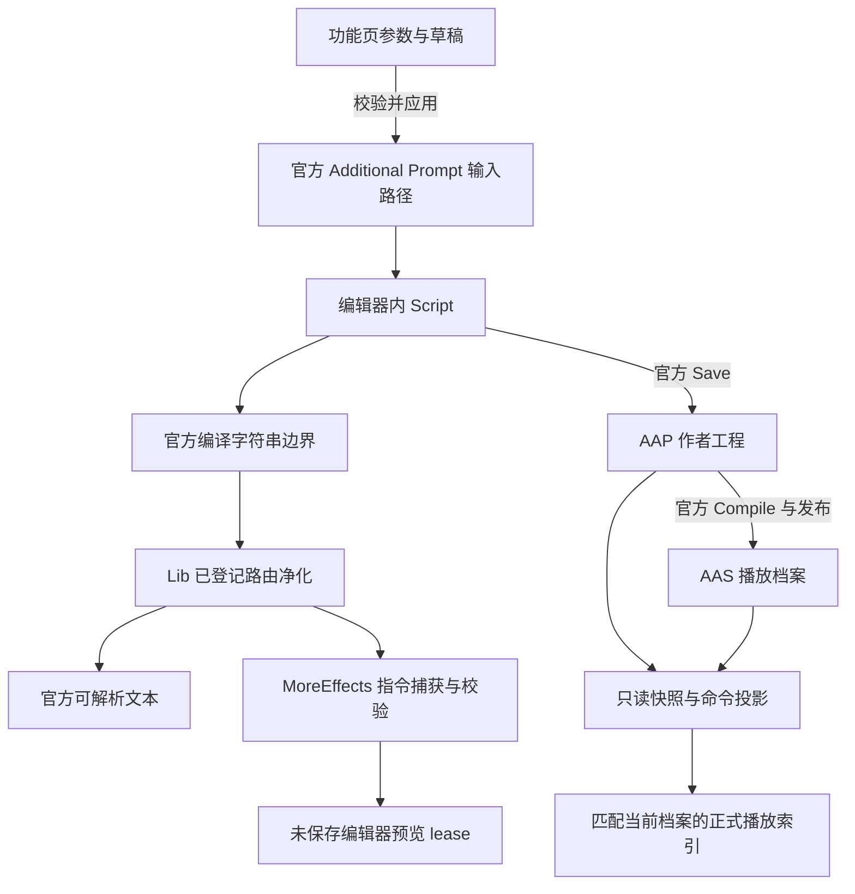

# 指令编辑、保存、编译与播放的完整数据路径

本文说明 Rukari Lib 0.4.2 与更多的画面效果 1.4.1 源码中，界面参数如何变成台词指令，以及编辑器预览和正式播放如何取得这些指令。文中的“身份”“revision”“lease”分别用于内容匹配、变更核对和一次登记/授权的生命周期，不是额外写入 AA 文件的新格式。

## 1. 先区分五种状态

| 状态 | 存放位置 | 生效范围 |
|---|---|---|
| 参数与草稿 | 功能页的托管状态 | 当前界面；尚未应用的参数不是工程内容。 |
| 已应用的额外指令 | 当前编辑器 Script 与官方输入框 | 当前编辑会话；可以产生未保存的预览。 |
| 已保存工程 | 官方 `.aap` | 持久化作者内容；仍需编译与发布才能对应正式播放。 |
| 已发布播放档案 | 官方 `.aas` | 正式播放读取的编译结果。 |
| Mod 播放命令投影与索引 | 托管内存，以及可选 Mod workspace | 将作者指令映射到匹配的播放记录，再交给功能执行器。 |

“应用草稿”“保存工程”“成功捕获一次编译字符串”“进入正式播放”是不同动作。当前实现不会因为其中一步成功就自动把所有其他状态视作已同步。



## 2. 统一的已登记指令路由

### 2.1 三个共享字符串边界

`Rukari.Lib.Runtime` 在三个返回托管字符串的边界安装同一组 prefix、postfix、finalizer：

- `Script.ScriptKr` getter；
- `Script.CompileScriptStandalone`；
- `Script.CompileScriptContinuous`。

postfix 对该边界返回的字符串进行处理。它不直接改写当前 Script 的原额外指令，不修改某份 `.aap` 或 `.aas` 文件。三个边界都找到且安装完成后，才发布 `rukari.commands.compilation` capability。

MoreEffects 的 `EditorEmbeddedDirectivePatch` 名称沿用历史，但当前实现不再自己安装这三处编译补丁；它从公共服务登记 `#aavt`，并按配置登记旧 `#char` 别名，保存自己的路由 lease。

依据：[共享边界补丁](../src/Rukari.Lib.Runtime/Commands/EmbeddedDirectivePatch.cs)、[共享宿主](../src/Rukari.Lib.Runtime/Commands/EmbeddedDirectiveHost.cs)、[MoreEffects 路由消费者](../src/AzureArchive.VideoTools/Runtime/EditorEmbeddedDirectivePatch.cs)。

### 2.2 路由按分号 token 匹配

`IEmbeddedDirectiveService.Register(ownerId, routes, callback)` 登记整行路由。例如父路由 `#aavt` 与另一个提供者的子路由 `#aavt;camera` 可以共存，最具体的匹配归属拥有该行；完全相同的路由冲突，不覆盖已有注册。

路由大小写不敏感，匹配时忽略各 token 两端空白。登记值被规范为小写；owner ID 使用登记时的标识。最多8个路由 token，单次登记最多32条，注册表总计最多512条。

一次 `Process` 先取得路由快照，确定所有行的归属，并生成所有回调共同看到的 `OfficialText`；随后逐个通知仍存活的注册。回调得到：

| 字段 | 含义 |
|---|---|
| `SourceText` | 此边界收到的原字符串；嵌套调用时可能已经经过内层净化。 |
| `OfficialText` | 本轮所有已登记路由共同净化后的最终文本。 |
| `RemovedDirectives` | 所有被登记路由移出的原始整行，含原行号、owner与匹配route。 |
| `OwnedDirectives` | 只归属于当前注册的行。 |
| `Boundary` / `CompilationId` / `IsAuthoritative` | 编译来源、嵌套调用关联和该边界族的权威性信息。 |

即使本轮没有自己的行，注册也会收到空 `OwnedDirectives`，用于观察最后一条指令被删除。提供者异常被隔离和记录，其他回调仍继续；异常不会使该提供者已移出的行自动重新进入官方文本。

依据：[路由与快照契约](../src/Rukari.Lib/Commands/EmbeddedDirectiveContracts.cs)、[EmbeddedDirectiveService](../src/Rukari.Lib/Commands/EmbeddedDirectiveService.cs)、[路由测试](../src/Rukari.Lib.Tests/EmbeddedDirectiveTests.cs)。

### 2.3 官方指令与未登记文本如何共存

净化只移出匹配已登记路由的整行。其他行的字符和行终止符保持原样；不会把所有 `#` 开头的行统统丢掉，也不会替官方解析器吞掉未登记命名空间的报错。

例如在已登记 `#aavt` 和 `#other` 的情况下：

```text
#wait;100
#aavt;char;3;set;x=500
#other;flash
正文
#unregistered;keep
```

官方结果保留 `#wait;100`、正文和 `#unregistered;keep`；两种已登记扩展交给对应提供者。该例中 `#unregistered` 是否有效，仍由原本处理它的解析流程决定。

这里有一个范围区别：MoreEffects 登记的是父路由 `#aavt`，所以未知的 `#aavt;某子命令` 也属于这个已登记命名空间。它会被移出官方文本，再由MoreEffects自己的解析器明确拒绝并报告，而不是继续当作官方指令；未登记的独立根命名空间则原样保留。

依据：[整行提取实现](../src/Rukari.Lib/Commands/EmbeddedDirectiveService.cs)、[混合命名空间测试](../src/AzureArchive.VideoTools.Tests/SharedDirectiveCompilationTests.cs)。

### 2.4 不可变 sanitizer 与登记变更

`CaptureSanitizer()` 同时捕获路由和 `Revision`，得到不保留插件回调的不可变快照，可以在线程池任务中处理一批作者文本。注销或新增路由不改变已经取得的快照；后续操作需重新取得。

`SanitizeExceptOwners(text, owners)` 保留指定owner的行，并移出其他已登记owner的行。它先使用全部路由确定归属，再决定保留，所以“保留父路由提供者”不会重新占有外部Mod的子路由。

MoreEffects 的磁盘/实时工程投影保留自己的owner和已知人物配音owner，再交给AAVT解析器。运行时监测注册表revision变化，清理预览缓存、连续对白身份并请求重新加载播放索引，避免继续执行旧路由集合生成的结果。

依据：[sanitizer实现](../src/Rukari.Lib/Commands/EmbeddedDirectiveService.cs)、[CaptureOwnedPromptProjection / RefreshDirectiveRegistry](../src/AzureArchive.VideoTools/Runtime/PlayerCommandObservationRuntime.cs)。

## 3. 嵌套编译、权威捕获与共同身份

### 3.1 同一次外层调用共用 CompilationId

Lib 的 `DirectiveCompilationTracker` 为每个编译线程维护堆栈。最外层开始时分配关联ID；嵌套的getter、独立编译和连续编译共用它，结束时按逆序退出。finalizer用于异常或其他补丁干预后的清理。

权威性分两种计数：`Continuous` 使用连续编译深度，`ScriptText` 与 `Standalone` 使用wrapper深度。当本族深度为1时该结果为权威结果。因此，在 `ScriptKr` 内嵌套的首次连续编译可以是权威结果；不能把 `IsAuthoritative` 简化为“整个调用栈必须只有一层”。

编译回调同步运行在编译发生的线程，不保证一定是Unity主线程。MoreEffects在此阶段处理托管字符串、解析结果和缓存；实际Unity写入走后续主线程调度。`CompilationId` 用来关联一次编译，不是场景持久ID，也不是播放事件序号。

依据：[DirectiveCompilationTracker](../src/Rukari.Lib/Commands/EmbeddedDirectiveCompilationTracker.cs)、[编译补丁范围管理](../src/Rukari.Lib.Runtime/Commands/EmbeddedDirectivePatch.cs)。

### 3.2 身份取共同 OfficialText

`CommandIdentity.CompiledScript` 对最终字符串建立三部分身份：UTF-8字节的SHA-256、UTF-16字符串长度、以换行计数得到的行数。MoreEffects使用Lib提供的共同 `OfficialText` 计算身份，不能仅移出自己的指令后计算，否则与其他功能Mod混用时会产生不同身份。

`AavtCompilationCaptureTracker` 只解析分配给MoreEffects的行；其他owner的更具体子路由从其解析视图移出，保留行终止符以维持错误行号。已知的 `rukari.charactervoice` / `#aavt;voice` 是明确例外：仅参与“无视觉效果”标记，不执行为立绘或镜头命令。

同一次CompilationId下，tracker记住已捕获AAVT指令的最终身份。内层捕获过指令后，外层得到相同的干净字符串，不能误认为作者删除了所有效果。下一次新编译若真的没有AAVT指令，才可以清理旧效果缓存；只有外国指令的编译也可以表达这种真实删除。

依据：[CommandIdentity](../src/AzureArchive.VideoTools.Core/Commands/CommandIdentity.cs)、[AavtCompilationCaptureTracker](../src/AzureArchive.VideoTools.Core/Commands/EmbeddedDirectiveCompilationTracker.cs)、[嵌套与混合命名空间测试](../src/AzureArchive.VideoTools.Tests/SharedDirectiveCompilationTests.cs)。

## 4. MoreEffects自己的指令校验

共享Lib负责归属与净化；MoreEffects通过 `EmbeddedAavtDirectiveExtractor` 和各command family解析语法、生成规范指令并检查资源冲突。支持的视觉命令族包括立绘变换、空槽待应用、镜头、Spine叠加轨道和人物预设动作；连续对白是单独标记。

当前一幕的预算为五个立绘资源、五个临时预设资源、十个Spine叠加资源及一个镜头资源，合计最多21条视觉命令。资源键区分槽位、命令族以及Spine轨道；相同资源重复占用、未知操作、无效参数或超预算都产生错误。

一个已登记行被净化不表示通过了这些校验。当前路径分别处理错误：

- 读编辑文档或创建草稿时，已有非法AAVT指令导致失败，不继续拼接出一个看似成功的新文档。
- 编译捕获中保留解析错误并记录；预览候选有错误时不能获得执行授权。
- 正式投影编译中发现非法指令时返回失败，不能把剩余部分默默当成整个场景的有效命令集。

`#aavt;continue` 与已知声音标记不产生视觉资源指令。仅含这些标记且无错误的捕获可以成为明确的空效果集合（tombstone）；纯粹空集合不能自动获得同样含义。

依据：[EmbeddedAavtDirectiveExtractor](../src/AzureArchive.VideoTools.Core/Commands/EmbeddedAavtDirectiveExtractor.cs)、[各command family](../src/AzureArchive.VideoTools.Core/Commands/CharacterTransformCommandFamilyCompiler.cs)、[预设命令族](../src/AzureArchive.VideoTools.Core/Commands/CharacterPresetCommandFamilyCompiler.cs)、[正式工程编译器](../src/AzureArchive.VideoTools.Core/Commands/EmbeddedProjectCommandCompiler.cs)。

## 5. 从参数草稿到官方输入写入

功能页读取当前台词后，保存它的选择token、原额外指令revision与场景地址。立绘/镜头等参数经纯托管builder形成规范指令，再由 `EditorCommandDocumentComposer` 预演文本变更。

composer负责按对应资源替换或追加一条指令，保留其他行；不会把整段额外指令全部重新排版。官方屏幕文字 `#st`、`#stm` 与清理文字 `#clearST` 使用自己的codec，仍留给AA官方编译/显示；连续对白开关由独立的AAVT标记表达。多条作者屏幕文字不能在没有明确规则时被工具随意压缩成一条。

MoreEffects的 `EditorCommandDocumentService` 还检查指令归属。如果当前 `#aavt` 或 `#char` 行已经由其他提供者的更具体路由接管，拒绝编辑；独立的外国命名空间可以保留而不造成这个冲突。

应用时的关键步骤：

1. 重新读当前选择和内容，比较原token与revision。
2. 用composer校验候选并生成目标全文和目标revision。
3. 再检查当前上下文、token、revision及场景地址。
4. 将原草稿的token与revision原样交给共享 `IEditorDocumentService.Replace`。
5. 共享backend执行 `UIInput.Set` → `SetAdditionalPrompt` 并精确读回；MoreEffects再核对目标revision与返回文档。

功能服务中的 `RollBack` 只报告共享事务已处理回滚，不再另外写入一次官方输入。共享撤销也委托Lib处理，避免两个模块各自维护相互覆盖的原文记录。

没有应用的草稿仍只是界面状态。应用成功只表示当前台词额外指令已通过读回核对，不表示 `.aap` 已保存或 `.aas` 已发布。

依据：[文档composer](../src/AzureArchive.VideoTools.Core/Commands/EditorCommandDocumentComposer.cs)、[MoreEffects文档服务](../src/Rukari.MoreEffects/Interop/EditorCommandDocumentService.cs)、[共享事务](../src/Rukari.Lib/Editor/EditorDocumentSession.cs)、[官方backend](../src/Rukari.Lib.Runtime/Editor/NativeEditorDocumentBackend.cs)、[文档保留与修改测试](../src/AzureArchive.VideoTools.Tests/EditorCommandDocumentTests.cs)。

## 6. 保存、编译、发布的实际调用

Lib绘制“工程保存”页，查找 `IEditorSaveService`。MoreEffects根据 `EditorSave.Enabled` 登记实际提供者；没有提供者时按钮不可用或返回明确失败。

`SaveAndPublish` 在主线程找到当前 `StudioCommon`，确认有效工程名，随后严格按顺序调用：

| 步骤 | 官方方法 | receipt字段 |
|---|---|---|
| 保存作者工程 | `Save(false)` | `Saved` |
| 编译脚本 | `Compile()` | `Compiled` |
| 发布可播放档案 | `Compile(projectName)` | `Published` |

配音提供者可通过兄弟接口 `IEditorPublicationScopeService.Begin(projectName)` 为完整手动调用链提供资源作用域。服务缺失时普通保存仍可用；服务存在但准入失败时不执行保存。票据覆盖三个阶段，并在任何返回或异常路径释放。伴随音频由既有安全落盘观察处理，Scope 本身不直接写官方工程文件。

配音 Mod 已移除普通 `Compile()` 返回后自动追加的 `Compile(projectName)`，因此后台编译不会再由它强制完整发布作品。更新可播放作品应使用上述手动按钮或 AA 的实际发布入口。该修订切断已观察到的一条重复发布阻塞路径，不表示全部场景性能已解决；详见[重复发布修复](12_fix6重播选槽与卡顿修复.md)。

任一步抛出异常就停止，并保留已经完成的阶段。例如工程已保存但编译失败，返回的receipt是 `Saved=true, Compiled=false, Published=false`；只看到外层 `ModResult.Success=true` 还不能显示“全部完成”，必须检查 `receipt.Complete`。

`EditorSaveReceipt.NothingToDo` 在契约中定义为三个字段都为false；当前MoreEffects实现没有预先检测干净工程并跳过的分支，而是直接尝试上述调用。因此该属性也可能对应第一步失败的receipt，应结合 `Detail` 判断，不能当作当前实现中的“无需保存”证明。

同样，当前三个布尔值表示对应官方调用未抛出异常，服务没有额外验证输出文件hash或重新解析发布档案。正式播放索引随后另行读取和核对当前文件。保存页的完成提示不替代这一步。

依据：[保存契约](../src/Rukari.Lib/Editor/EditorSaveContracts.cs)、[实际保存提供者](../src/AzureArchive.VideoTools/Interop/EditorSaveService.cs)、[保存页](../src/Rukari.Lib.Runtime/Editor/EditorSaveToolPage.cs)、[提供者登记](../src/Rukari.MoreEffects/Plugin.cs)。

## 7. 未保存编辑器预览

### 7.1 编译候选、选择代次与窗口

编辑器预览不要求先建立持久 `.aap` / `.aas` 映射。`EditorDataListEventProbe` 在DataList边界取得当前场景的托管快照并打开一代预览收集；权威连续编译捕获为该代提供规范指令候选，选择事件可以进一步确认编译身份。

窗口门槛使用DataList开始时已经完全关闭的窗口水位。DataList可能发生于同一次预览级联的中间，所以不能简单要求窗口必须在DataList之后才打开；已彻底结束的旧窗口才被排除。

`EmbeddedEditorPreviewLeaseCache.TryClaim` 要求：有活动代次，窗口未过期且没有重复claim，窗口字符串与候选身份唯一相交，候选无错误或冲突，选择确认身份一致，并重新核对当前live节点、行索引与指纹。新发现的项目key可以在内容身份匹配后采用，后续项目key轮换则清除旧覆盖状态。

拒绝一个属于当前预览代的窗口会返回已识别但不执行，不再回退到陈旧的持久命令。编译字符串的SHA相同本身不够；还需当前窗口、场景地址和预览模式匹配。

依据：[DataList观察](../src/AzureArchive.VideoTools/Runtime/EditorDataListEventProbe.cs)、[选择观察](../src/AzureArchive.VideoTools/Runtime/EditorSelectionEventProbe.cs)、[Runtime预览lease缓存](../src/AzureArchive.VideoTools/Runtime/EmbeddedEditorPreviewLease.cs)。

### 7.2 仍需通过下游gate和资源规划

取得Runtime lease后，`PlayerCommandObservationRuntime.TryHandleEditorPreviewLease` 再调用Core的 `EditorPreviewLeaseGate`，核对预览模式、捕获/当前选择、准确字符串出现次数和指令资源，再生成执行计划与资源footprint。同一次managed update内的同代级联窗口额外去重。

执行先排入主线程的同帧 `LateUpdate`，并处理空槽扫描和继承状态；不会从编译线程直接改Unity对象。已有预览资源在切换、删除指令或转入正式播放时清理，避免旧效果遗留。tombstone明确替换旧的场景效果集合为空，但仍参与清理和继承语义。

当前源码存在一项需要按实际调用理解的策略差异：Runtime缓存已经允许同一代中新的窗口序号再次claim，Core的 `EditorPreviewLeaseGate` 仍按 `SelectionGeneration` 单次消费，且失败尝试也消费。调用链仍经过这个Core gate；所以仅看到缓存中的重放支持，不能得出整条lease路径已允许同代无限重复预览的结论。重新发起DataList可以生成新代次。本文保留并说明现有实现，没有修改该策略。

依据：[预览授权调用与LateUpdate调度](../src/AzureArchive.VideoTools/Runtime/PlayerCommandObservationRuntime.cs)、[Core gate与资源模型](../src/AzureArchive.VideoTools.Core/Commands/EditorPreviewLeasePlanner.cs)、[托管预览授权测试](../src/AzureArchive.VideoTools.Tests/EditorPreviewLeaseTests.cs)。

### 7.3 未保存的祖先指令与链式继承

预览链可以使用编辑器当前节点图的只读托管快照，包含未保存的当前场景及祖先编辑；`LiveProjectGraphService` 在主线程读取leaf值，不保留native wrapper，按失效标志和去抖重建。读取live图失败时回退到磁盘图。

立绘链与镜头链由各自的Core resolver折叠前驱结果，检查分支歧义、循环和深度限制。当前场景的live覆盖可替换旧的保存内容；明确空效果覆盖也必须保留。正式播放继续使用已保存工程图，不能把编辑器中未保存的祖先状态偷偷带入正式档案。

依据：[LiveProjectGraphService](../src/AzureArchive.VideoTools/Interop/LiveProjectGraphService.cs)、[立绘前驱链](../src/AzureArchive.VideoTools.Core/Commands/PreviewChainResolver.cs)、[镜头前驱链](../src/AzureArchive.VideoTools.Core/Commands/PreviewCameraChainResolver.cs)、[预览配置](../src/Rukari.MoreEffects/Runtime/PlayerCommandObservationOptions.cs)。

## 8. 正式播放的workspace、投影与索引

### 8.1 文件快照与作者指令投影

正式路径读取当前AAP作者工程和AAS播放档案，建立各自的路径key、revision、文件长度及修改时间快照。`AapProjectReader` 读取作者节点和场景；`AasScenarioReader` 通过受检FlatBuffer读取已知字段和播放记录，不依赖游戏中的native对象。

`EmbeddedProjectCommandCompiler` 从作者场景的额外指令提取规范命令，并借助项目/档案映射生成 `PlaybackCommandProjection`。投影绑定具体作者revision与具体AASrevision、schema，不只是绑定工程名称。AAS中的官方播放文本如果仍混入AAVT扩展行，编译器会拒绝受污染的记录。

连续对白标记也从当前作者/播放匹配结果得到权威身份集合；不能只因某个历史缓存出现过相同文本就永远保持连续状态。

依据：[AAP reader](../src/AzureArchive.VideoTools.Formats/Aap/AapProjectReader.cs)、[AAS reader](../src/AzureArchive.VideoTools.Formats/Aas/AasScenarioReader.cs)、[CheckedFlatBuffer](../src/AzureArchive.VideoTools.Formats/Aas/CheckedFlatBuffer.cs)、[EmbeddedProjectCommandCompiler](../src/AzureArchive.VideoTools.Core/Commands/EmbeddedProjectCommandCompiler.cs)。

### 8.2 可选的Mod workspace

现有架构还允许Mod自己的JSON workspace保存manifest、作者timeline与播放projection。它们位于Mod工作区，包含schema、workspace身份、源文件revision和所需能力；不是往AAP/AAS中增加新字段。

正式索引加载时，先校验workspace兼容性，再检查timeline和projection与当前工程/档案匹配。有workspace但不能执行、timeline过期、projection缺失或不匹配，都返回对应失败，而不是直接使用旧投影。

若作者额外指令同时生成内嵌投影，`PlaybackCommandProjectionComposer` 将其与可选sidecar投影合并并检查冲突。没有sidecar时，内嵌指令也可以生成正式命令索引；不能把workspace文件说成每个普通用户必须手动建立的前提。

依据：[workspace契约与兼容性](../src/AzureArchive.VideoTools.Core/Workspaces/ModWorkspaceContracts.cs)、[JsonModWorkspaceStore](../src/AzureArchive.VideoTools.Formats/Workspace/JsonModWorkspaceStore.cs)、[JsonCommandWorkspaceStore](../src/AzureArchive.VideoTools.Formats/Workspace/JsonCommandWorkspaceStore.cs)、[投影合并](../src/AzureArchive.VideoTools.Core/Commands/PlaybackCommandProjectionComposer.cs)、[实际索引加载](../src/AzureArchive.VideoTools/Runtime/PlayerCommandObservationRuntime.cs)。

### 8.3 播放记录匹配与执行去重

`PlaybackCommandBinder` 把已校验投影绑定到当前档案记录；`PlaybackCommandWindowObserver` 使用实际窗口字符串的完整身份确定记录。正式播放可使用播放行索引辅助区分相同文本；编辑器预览的engine行号与已发布档案没有同等关系，不能照搬这一辅助值。

`PlaybackSceneDispatchGate` 再次检查场景字段、命令GUID、顺序、阶段、能力、规范语法和资源唯一性，只授权递增且未消费的窗口序号。授权结果交由主线程执行器处理；日志里观察到字符串或would-dispatch不等于已经执行效果。

默认配置是 `SceneCommandDispatch` 阶段并启用其独立开关。源码同时保留只观察、身份检查、测试性canary等阶段，文档中的完整流程以实际执行阶段为前提；已有用户配置仍会覆盖默认值。

依据：[PlaybackCommandBinding](../src/AzureArchive.VideoTools.Core/Commands/PlaybackCommandBinding.cs)、[窗口观察](../src/AzureArchive.VideoTools.Core/Commands/PlaybackCommandWindowObservation.cs)、[正式授权gate](../src/AzureArchive.VideoTools.Core/Commands/PlaybackSceneDispatchGate.cs)、[当前默认配置](../src/Rukari.MoreEffects/Runtime/PlayerCommandObservationOptions.cs)。

### 8.4 保存尚未发布的过渡状态

作者工程先保存、播放档案尚未更新时，两者可能无法建立命令映射。运行时用文件修改时间与档案签名分类该状态，后续轮询变化并重新加载；等待结束仍不匹配则报告失败。修改时间只是加载协调信息，最终仍以文件快照、内容身份与映射校验为准。

索引重载会丢弃旧索引、待执行批次和旧预览状态，并清理slot pending；不能在新的档案revision下沿用已过期的执行批次。路由revision变化也走这一失效路径。

依据：[ProjectPublicationConsistency](../src/AzureArchive.VideoTools.Core/Projects/ProjectPublicationConsistency.cs)、[索引加载与重载](../src/AzureArchive.VideoTools/Runtime/PlayerCommandObservationRuntime.cs)。

## 9. 文件读写边界

这里的“不直接改AAP/AAS”指当前Mod自己的格式层与命令执行层不拼接、打补丁或覆盖这些官方文件。作者指令通过官方UI输入路径进入编辑会话；需要持久化时调用AA自己的保存和发布API，由AA完成官方文件写入。

`Formats`中的AAP/AAS reader用于只读解析。可写的JSON store写的是Mod自己的工作区与sidecar文档；它们有自己的schema和一致性校验。运行时预览覆盖、编译捕获和命令索引主要保存在托管内存，不构成对官方文件格式的扩展。

这也解释了三个常见结果：界面应用成功但未保存时可以预览而不能当成正式发布；只保存AAP时正式播放可能仍读旧AAS；真正进入正式命令执行还要通过当前档案索引、窗口匹配和执行授权。

更多的立绘槽位、坐标与动作实现，见本交付包的立绘操控文档；共享事务与统一UI接口，见 [03_RukariLib接口与统一UI](03_RukariLib接口与统一UI.md)。
